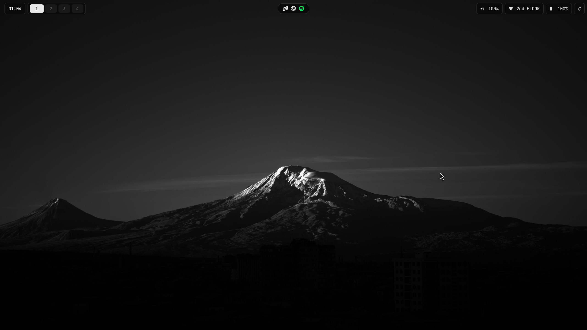
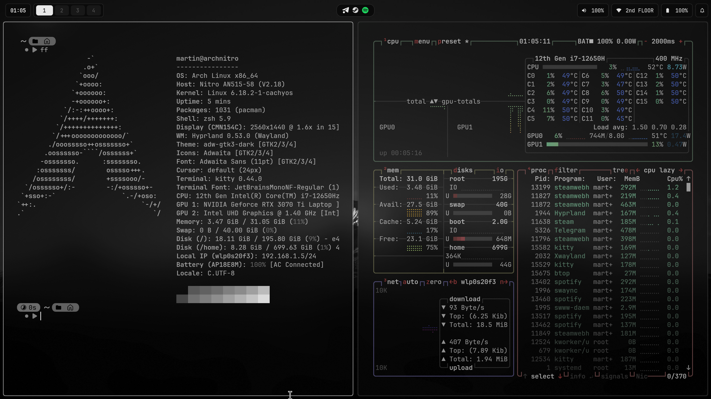
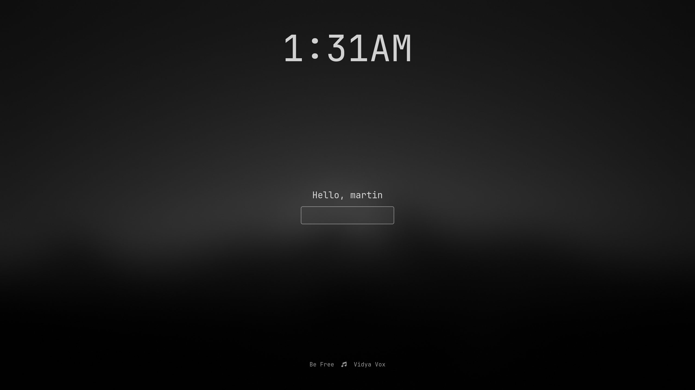
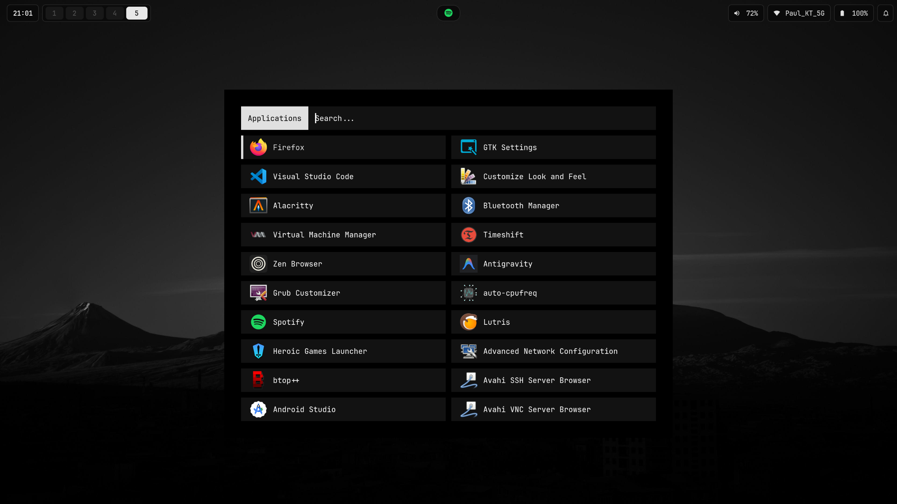
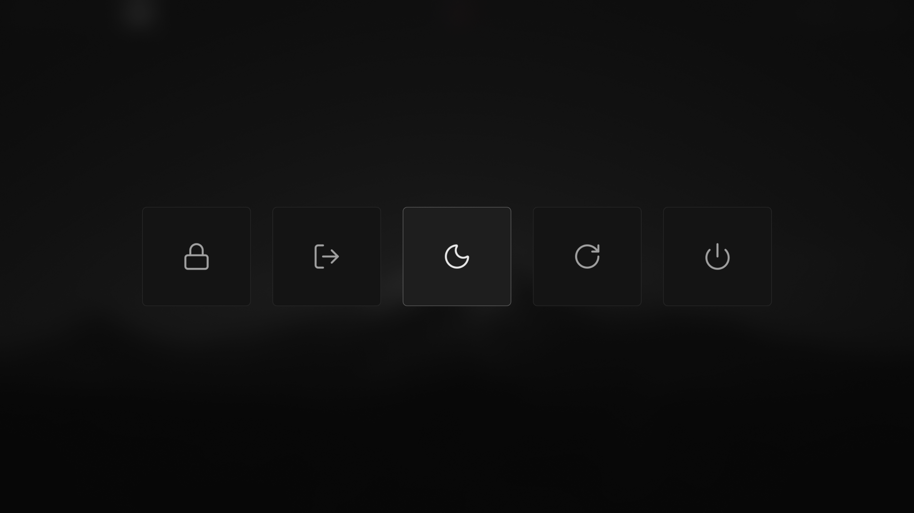
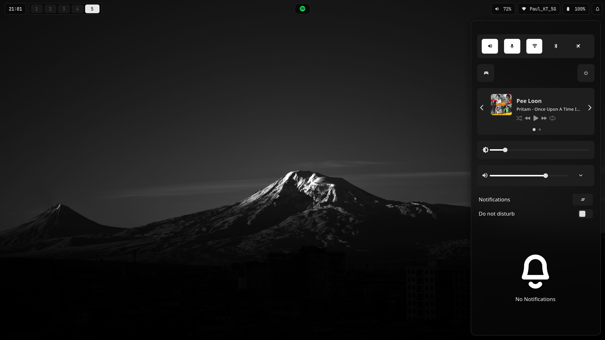
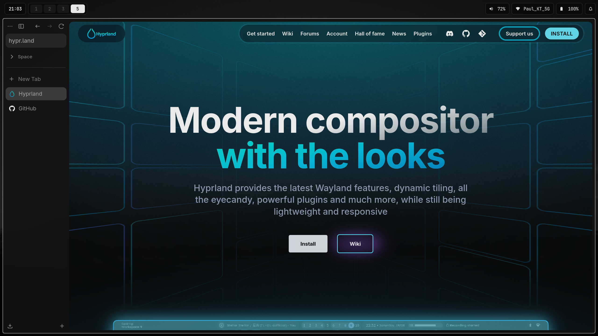

# hypr-dotfiles

My personal Hyprland rice — a dark, blurred, mostly-monochrome setup built around a **Lua-configured Hyprland**.

Everything here is what I actually run day to day. Grab whatever's useful.


---

## Screenshots

**Desktop**



**Terminal — fastfetch + btop**



**Lock screen (hyprlock)**



**Rofi launcher**



**Logout menu (wlogout)**



**Notification centre (SwayNC)**




**Zen Browser**



---

## Hyprland configured in Lua

Most Hyprland rices ship a pile of `.conf` files in hyprlang. This one doesn't — the whole
compositor config is **Lua**, using Hyprland's `hl` API:

Entry point is [`hyprland.lua`](hyprland/.config/hypr/hyprland.lua), which requires six modules:

| Module | What's in it |
|---|---|
| [`env.lua`](hyprland/.config/hypr/modules/env.lua) | Wayland/toolkit env vars, HiDPI scaling, NVIDIA bits |
| [`autostart.lua`](hyprland/.config/hypr/modules/autostart.lua) | waybar, awww, hypridle, polkit agent, batsignal, cliphist |
| [`binds.lua`](hyprland/.config/hypr/modules/binds.lua) | every keybind |
| [`monitors.lua`](hyprland/.config/hypr/modules/monitors.lua) | display layout — **edit this first** |
| [`decorations.lua`](hyprland/.config/hypr/modules/decorations.lua) | gaps, blur, opacity, shadows, animation curves |
| [`windowrules.lua`](hyprland/.config/hypr/modules/windowrules.lua) | layer blur for rofi/swaync/wlogout, idle inhibit |

> **Heads up:** the Lua config format needs a reasonably recent Hyprland — one that ships
> `/usr/share/hypr/stubs`. This is built and tested against **0.56.2**.

---

## What's in the rice

| | Using | Package |
|---|---|---|
| Compositor | [Hyprland](https://hyprland.org/) | `hyprland` |
| Bar | [Waybar](https://github.com/Alexays/Waybar) | `waybar` |
| Launcher | [Rofi](https://github.com/davatorium/rofi) | `rofi` |
| Notifications | [SwayNC](https://github.com/ErikReider/SwayNotificationCenter) | `swaync` |
| Lock screen | [hyprlock](https://github.com/hyprwm/hyprlock) | `hyprlock` |
| Idle daemon | [hypridle](https://github.com/hyprwm/hypridle) | `hypridle` |
| Logout menu | [wlogout](https://github.com/ArtsyMacaw/wlogout) | `wlogout` |
| Wallpaper | [awww](https://codeberg.org/LGFae/awww) | `awww` |
| Terminal | [Kitty](https://sw.kovidgoyal.net/kitty/) (main), [Alacritty](https://alacritty.org/) (spare) | `kitty` `alacritty` |
| Shell | [Zsh](https://www.zsh.org/) + [Starship](https://starship.rs/) | `zsh` `starship` |
| Editor | [Neovim](https://neovim.io/) ([LazyVim](https://www.lazyvim.org/)) | `neovim` |
| Files | [Thunar](https://docs.xfce.org/xfce/thunar/start) | `thunar` |
| Browser | [Zen Browser](https://zen-browser.app/) | `zen-browser-bin` (AUR) |
| Clipboard | [cliphist](https://github.com/sentriz/cliphist) | `cliphist` |
| Screenshots | grim + slurp | `grim` `slurp` |


---

## Fonts (read this one — it's the usual reason a rice looks broken)

Everything needs **JetBrainsMono Nerd Font**, and the *variant* matters:

```bash
sudo pacman -S ttf-jetbrains-mono-nerd
```

| Variant | Used by |
|---|---|
| `JetBrainsMono Nerd Font Propo` | Waybar, SwayNC, hyprlock |
| `JetBrainsMono NFP Light` | Rofi |
| `JetBrains Mono Nerd Font` | Kitty, Alacritty |

`Propo` is the proportional build — it gives glyphs room to breathe, which is what keeps the bar
from looking cramped. The base and `Mono` variants will *work* but the spacing goes off.

Verify it landed:

```bash
fc-list : family | grep -i "JetBrainsMono Nerd Font Propo"
```

**If that prints nothing, every icon in Waybar and SwayNC renders as an empty box** and the whole
thing looks broken on first launch. It's not — you're just missing the font.

---

## Install

### Quick way

```bash
git clone https://github.com/thomasmartinoa/hypr-dotfiles.git ~/hypr-dotfiles
cd ~/hypr-dotfiles
./install.sh
```

The script installs the packages, symlinks everything with stow, creates `~/Pictures/screenshot`
(the screenshot binds need it to exist), and warns you about the font and the monitor config.
It refuses to clobber existing real files — if it finds any it tells you which and stops.

```bash
./install.sh --dry-run     # show what would be linked, change nothing
./install.sh --stow-only   # skip package installation
```

### Manual way

Packages, if you'd rather do it yourself:

```bash
# compositor + desktop
sudo pacman -S hyprland hyprlock hypridle waybar rofi swaync awww \
               xdg-desktop-portal-hyprland polkit-gnome qt6ct power-profiles-daemon

# terminal + shell
sudo pacman -S kitty alacritty zsh starship

# cli tools
sudo pacman -S neovim fastfetch btop eza

# utilities
sudo pacman -S grim slurp wl-clipboard cliphist playerctl brightnessctl \
               batsignal jq thunar pavucontrol networkmanager nm-connection-editor

# font (see the section above) + stow
sudo pacman -S ttf-jetbrains-mono-nerd stow
```

`wlogout` isn't in the Arch repos — it's in the AUR (`paru -S wlogout`). On CachyOS it's in the
`[cachyos]` repo, so plain `pacman -S wlogout` works there.

Then symlink with stow:

```bash
git clone https://github.com/thomasmartinoa/hypr-dotfiles.git ~/hypr-dotfiles
cd ~/hypr-dotfiles

# everything
stow alacritty hyprland kittyterminal nvim rofi starship swaync waybar wlogout zsh

# or just what you want
stow hyprland waybar
```

The repo can live anywhere — nothing hardcodes its path. Wallpapers ship inside the `hyprland`
package, so stow puts them at `~/.config/hypr/wallpapers/` wherever you cloned to.

---

## Layout

Each top-level folder is a GNU Stow package that mirrors your home directory:

```
alacritty/       →  ~/.config/alacritty/
hyprland/        →  ~/.config/hypr/          (lua config, hyprlock, hypridle, wallpapers, scripts)
kittyterminal/   →  ~/.config/kitty/
nvim/            →  ~/.config/nvim/          (LazyVim)
rofi/            →  ~/.config/rofi/
starship/        →  ~/.config/starship.toml
swaync/          →  ~/.config/swaync/
waybar/          →  ~/.config/waybar/
wlogout/         →  ~/.config/wlogout/
zsh/             →  ~/.zshrc

Screenshots/     →  images for this README (not a stow package)
install.sh       →  installer
```

---

## Keybinds

`SUPER` is the mod key. All of these live in
[`modules/binds.lua`](hyprland/.config/hypr/modules/binds.lua).

### Launching

| Keys | Action |
|---|---|
| `SUPER` + `Return` | Terminal (kitty) |
| `SUPER` + `D` | App launcher (rofi) |
| `SUPER` + `E` | File manager (thunar) |
| `SUPER` + `B` | Browser (zen-browser) |
| `SUPER` + `V` | Clipboard history (cliphist via rofi) |
| `SUPER` + `L` | Lock screen (hyprlock) |
| `SUPER` + `M` | Logout menu (wlogout) |
| `SUPER` + `R` | Restart waybar + swaync |

### Windows

| Keys | Action |
|---|---|
| `SUPER` + `Q` | Close window |
| `SUPER` + `T` | Toggle floating |
| `SUPER` + `F` | Fullscreen |
| `SUPER` + `SHIFT` + `F` | Maximize |
| `SUPER` + `P` | Pseudo-tile |
| `SUPER` + `J` | Toggle split direction |
| `SUPER` + `←↑↓→` | Move focus |
| `SUPER` + drag `LMB` | Move window |
| `SUPER` + drag `RMB` | Resize window |

### Workspaces

| Keys | Action |
|---|---|
| `SUPER` + `1`–`0` | Switch to workspace 1–10 |
| `SUPER` + `SHIFT` + `1`–`0` | Move window to workspace 1–10 |
| `SUPER` + scroll | Cycle workspaces |
| `SUPER` + `S` | Toggle scratchpad (special workspace `magic`) |
| `SUPER` + `SHIFT` + `S` | Move window to scratchpad |
| 3-finger horizontal swipe | Switch workspace |

### Screenshots

Saved to `~/Pictures/screenshot/` **and** copied to the clipboard.

| Keys | Action |
|---|---|
| `SUPER` + `Print` | Whole screen |
| `SUPER` + `X` | Select a region |
| `SUPER` + `SHIFT` + `Print` | Active window |
| `SUPER` + `SHIFT` + `X` | Region → clipboard only, no file |

### Media & hardware keys

Volume, mic mute, brightness and playback all work while locked. Playback keys need `playerctl`;
brightness targets `intel_backlight`

---

## Customising

### Wallpaper

Wallpapers live in [`hyprland/.config/hypr/wallpapers/`](hyprland/.config/hypr/wallpapers/) and get
symlinked to `~/.config/hypr/wallpapers/`. The one set at login is in
[`modules/autostart.lua`](hyprland/.config/hypr/modules/autostart.lua):

```lua
hl.exec_cmd("awww-daemon & awww img ~/.config/hypr/wallpapers/montain_main.png")
```

Drop your own image in that folder and point the line at it. To change it live:

```bash
awww img /path/to/wallpaper.png --transition-type grow
```

The lock screen background is separate — it's `~/.config/hypr/hyprlock.png`, set in `hyprlock.conf`.

### Blur, opacity and gaps

All in [`modules/decorations.lua`](hyprland/.config/hypr/modules/decorations.lua):

```lua
hl.config({
    general = {
        gaps_in  = 5,
        gaps_out = 7,
        border_size = 1,
        layout = "dwindle",
    },

    decoration = {
        rounding         = 4,
        active_opacity   = 0.9,     -- focused window
        inactive_opacity = 0.7,     -- everything else

        blur = {
            enabled  = true,
            size     = 8,
            passes   = 3,           -- more passes = heavier blur, more GPU
            vibrancy = 0.1696,
        },
    },
})
```

If the blur costs you frames, drop `passes` to `2` before touching anything else.

Animation curves are in the same file — five named beziers driving fifteen animation leaves. The
window motion is `easeOutQuint` with `popin 87%`; there's a commented-out spring config at the
bottom if you prefer the newer upstream feel.

### Colours

The palette is monochrome and lives in three files, each importable on its own:

- [`waybar/.config/waybar/colors/black-min.css`](waybar/.config/waybar/colors/black-min.css)
- [`swaync/.config/swaync/colors/black-mid.css`](swaync/.config/swaync/colors/black-mid.css)
- [`rofi/.config/rofi/colors/black.rasi`](rofi/.config/rofi/colors/black.rasi)

Kitty's palette is inline at the bottom of `kitty.conf`.

---

## Gotchas

These are hardcoded to *my* laptop. Check them before you file a bug:

- **Monitor.** [`modules/monitors.lua`](hyprland/.config/hypr/modules/monitors.lua) assumes a single
  `eDP-1` at `2560x1440@165Hz`, scale `1.6`. Almost certainly wrong for you — run `hyprctl monitors`
  and fix it. The `1.6` scale is also mirrored in `env.lua` as `QT_SCALE_FACTOR` and
  `JDK_JAVA_OPTIONS`; change all three together.
- **NVIDIA.** [`env.lua`](hyprland/.config/hypr/modules/env.lua) sets `GBM_BACKEND=nvidia-drm` and
  `LIBVA_DRIVER_NAME=nvidia`. Comment those out on AMD or Intel-only machines. PRIME offload and
  `WLR_NO_HARDWARE_CURSORS` are in there too, commented, if you need them.
- **Backlight device.** Brightness binds and the SwayNC backlight widget both target
  `intel_backlight`. Check `ls /sys/class/backlight/` and substitute yours.
- **Keyboard backlight.** [`hypridle.conf`](hyprland/.config/hypr/hypridle.conf) dims
  `rgb:kbd_backlight` after 4 minutes. Comment that listener out if you don't have one.
- **Screenshot directory.** The binds pipe through `tee`, which won't create the folder. If you
  skipped `install.sh`, run `mkdir -p ~/Pictures/screenshot` yourself.

---

## Credits

- [Hyprland](https://hyprland.org/) and the whole hypr* ecosystem
- [awww](https://codeberg.org/LGFae/awww) by LGFae
- [LazyVim](https://www.lazyvim.org/) for the Neovim base

## License

[MIT](LICENSE) — do what you like with it. If a piece of this ends up in your own rice, I'd love to
see it, but you're under no obligation.
